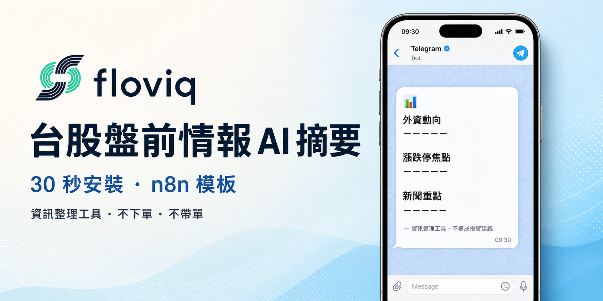

  

  

# floviq · n8n workflow templates

> 開源的 n8n workflow templates 集合 — 給台股 / 投資族群的自動化工具

---

## 是什麼

floviq 提供一系列即可用的 n8n workflow templates，覆蓋台股投資情報、外資追蹤、漲跌停監控等使用情境。

每個 template 是**獨立可用的單元**，import 進你的 n8n 後填好 credential 就能跑，不需要寫 code。

## Templates 列表

| Template | 介紹 | 最新版 | License |
|---|---|---|---|
| [001-pre-market-briefing](./001-pre-market-briefing/v0.1.1-free/) | 台股盤前情報 AI 摘要 → Telegram 推播 | v0.1.1-free | [Personal Use](./001-pre-market-briefing/v0.1.1-free/LICENSE.txt) |

### 即將上線

| Template | 介紹 | 預計 |
|---|---|---|
| 002-foreign-flow-tracker | 外資進出追蹤週報 | coming soon |
| 003-limit-up-monitor | 漲停板即時監控 | coming soon |
| 004-earnings-calendar | 財報日程提醒 | coming soon |
| 005-news-aggregator | 台股新聞聚合 | coming soon |

## 怎麼用（30 秒安裝）

任一 template 安裝邏輯都一樣：

1. 進入 template 資料夾的 README（譬如上表的 `001-pre-market-briefing/v0.1.1-free/`）
2. 跟著該 README 的「開始使用」段做
3. 主要動作只有：複製一條 raw URL → 在 n8n 點 Import from URL → 貼上 → Save

## 為什麼用 Import from URL 而非下載 zip

- 少 3 步驟（不用解壓、不用找檔、不會被 macOS Gatekeeper 警告）
- 透明 — 你能在 GitHub 上 review workflow.json 內容再 import
- 永遠拿到最新版（template 更新後再 import 即可拿到 patch）

仍想 offline backup？每個 template 資料夾內都附 zip + sha256，視為「想存個快照」的選項。

## 授權

每個 template 自帶 `LICENSE.txt`，請看對應 template 資料夾。

通用條款：個人 / 公司內部使用免費；不可轉售、不可包裝成商業投顧服務。

## 連絡 / 回饋

- Issues：直接在本 repo 開 issue
- 商業合作 / Paid 版本：Paid 版預計 2026-Q2 上架，屆時資訊會在 README 同步

## 關於 floviq

floviq 是專注於資訊整理工具的 indie maker — 我們不下單、不帶單、不提供投資建議，純粹把公開資訊整理成你能在 30 秒讀完的訊息。
